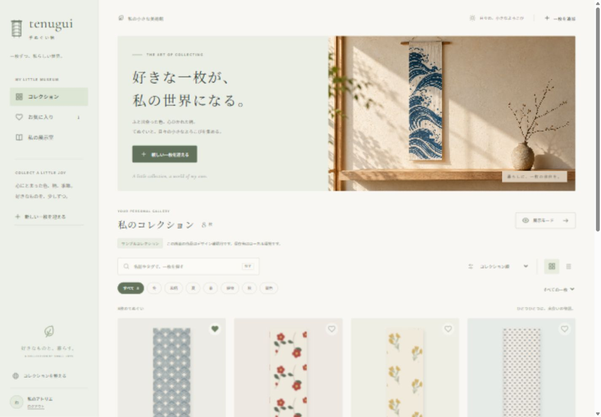

# リニューアルの検証記録

2026-10-03、Windows / Node.js 24.18.0。最新の見直しは本番からコピーした54枚で確認しました。登録の検証はローカルのみで行っています。本番KVへの書き込み・本番デプロイは行っていません。

## PWA更新と花柄アイコンの調整

2026-10-03、再インストール不要の更新導線と、旧版の花柄を保った苔色・生成りのアイコンを追加しました。[PWAの更新](pwa-updates.md)に旧版の初回移行とOS側のアイコン反映をまとめています。

- `npm test`は72件成功。PWAの14件では初回インストール、明示適用後の一度だけの再読み込み、延期、入力の開始、他タブとの競合、通信復帰、失敗時の再試行、キャッシュ境界を検証しました。
- `npm run typecheck`と最終変更後の`tsc -b`は成功。`npm run build`はブラウザ・Cloudflare SSRとも成功しました。
- 生成された`build/client/sw.js`がビルド固有の版を持ち、最新のworker/controllerとアイコンを含むことを確認しました。
- `npm run icons`で再生成に成功。マニフェストの12個の画像参照、寸法、不透明性、HTMLのアイコン参照を確認。縮小表示・円形マスク・安全円は画像単体で確認しました。

ローカルURLへのブラウザアクセスは権限確認で拒否されたため、今回の更新表示の画面確認・実端末でのインストール済みPWAの更新は未実施です。本番デプロイは行っていません。

## コレクションを眺める体験の見直し

[デザインと改善記録](quality-review.md)に、公式審査基準・参考サイト・画面確認からの改善をまとめています。

- PC 1440×1000、スマホ390×844・360×740、横向き844×390で一覧・リスト・鑑賞・詳細を確認。横方向のはみ出しなし。
- 検索「春」で54枚から13枚、手元にある29枚／気になる25枚への絞り込み。
- 検索中のリンクコピーが検索パラメータを含まず、コレクション全体のルートURLになること。
- 鑑賞の前後移動・矢印キー・Escape、閉じた後のフォーカス復帰。
- メニューのTab・Shift+Tabによる循環、Escapeとフォーカス復帰。
- 写真以外の任意欄が最初は閉じ、画像URLと「気になる」の選択だけで名前未入力の登録が成功。検証用の一枚はローカルで復元可能な状態に外し、一覧が54枚へ戻ること。
- スマホでアイコンだけになる検索・鑑賞操作にも読み上げ用の名前があること。
- 共有のキャンセル・失敗時、検索の再取得制御、任意欄の入力保持、認証の境界を別担当がコードレビュー。

## 自動検証

| 確認                | 結果                             |
| ------------------- | -------------------------------- |
| `npm ci`            | lockfileから再インストール成功   |
| `npm test`          | 58件成功、失敗・skipなし         |
| `npm run typecheck` | 成功                             |
| `npm run build`     | ブラウザ・Cloudflare SSRとも成功 |
| `npm audit`         | 既知の脆弱性0件                  |

テストは実際のTSモジュールをfake KVとmock HTTPで実行しています。旧データの保持、DEVと本番の境界、写真の容量・形式・認証、保存失敗時の入力保持、編集・削除前のバックアップ、復元、タグ一括更新、展示の順序・公開範囲、お気に入りの競合・保存失敗、OAuthのstate・メール許可・セッション期限を含みます。

本番ビルドをローカルで起動して、未ログインの認証APIがfalseを返し、登録・設定・展示管理の画面がログインへ遷移、保存APIが401を返すことを確認しました。公開展示は200で表示され、選択順を保持し、メモ・商品URL・開発用ユーザーをHTMLへ含めません。

## 初回リニューアルで確認した操作

以下はサンプルデータで行った初回の確認です。最新の54枚を使った確認は上記に記載しています。

- 写真の選択から縮小・アップロード・登録・詳細表示まで。
- 写真が無いときのエラー表示と入力保持、修正後のエラー解除。
- 画像URLからの登録と、保存成功時の詳細ページへの遷移。
- 未保存入力の移動確認。移動を取りやめると入力が残ること。
- 検索・絞り込み、お気に入りの保存と再読込後の保持。
- 鑑賞モードの次の一枚・矢印キー操作、閉じた後のフォーカスと背景スクロールの復帰。
- 二枚の展示を作成・並べ替え・公開し、共有リンクをコピー。
- コレクションの順序を変更・保存。
- テスト用の一枚を棚から外し、設定画面から写真と記録を復元。
- 削除確認のEscapeによるキャンセル。
- モバイルメニューのTab・Shift+Tab・Escape操作。
- PC 1440×1000、スマートフォン390×844で横方向のはみ出し・画像読み込み失敗なし。

[PC全体](previews/desktop-full.jpg) / [スマートフォン](previews/mobile.jpg) / [鑑賞モード](previews/viewing-room.jpg) / [公開展示](previews/exhibition-mobile.jpg)

この初回確認画像の柄と紹介文はサンプルです。最新画面はCloudflare Previewを参照してください。

## Cloudflare Previewでの既存データ確認

2026-10-03、本番の`items`を本番とは別のPreview専用KVへコピーしました。54枚すべてが既存の外部画像URLを参照するため、写真バイナリのコピーは不要でした。セッション・Secrets・非公開展示はコピーしていません。

コピー前後のJSONをSHA-256で照合し、Previewが完全なコピーであることと、本番の記録が変更されていないことを確認しました。本番との自動同期はありません。

[Cloudflare Preview](https://codex-japandi-gallery-tenugui.takatama.workers.dev)で、54枚の一覧、検索による54枚から13枚への絞り込み、詳細写真の読み込み、鑑賞モードの次の一枚への切り替えを確認しました。Google OAuth用Secretsは未設定で、ログイン・編集は未確認です。

今回の見直し後もWranglerで同じPreviewを更新しました。Cloudflare上でPC・スマホの表示、共有用メタ情報、検索中のルートURLコピー、鑑賞とフォーカス復帰を確認。幅360pxで主要な4つの表示操作は44×44px以上となり、横方向のはみ出しはありません。ブラウザのconsole errorは0件です。再度SHA-256を照合し、本番・Previewとも元の54枚の記録と完全一致していることを確認しました。

## 本番設定・実端末で残る確認

Googleとの実際のOAuth、外部の商品情報API、Cloudflare本番KVの伝播と同時編集、実端末のカメラ・共有シート・PWAインストールは未確認です。共有リンクのコピーはブラウザで確認しています。

既存コレクションと詳細ページは従来どおり公開です。展示の非公開設定を、コレクション全体の非公開機能と混同しないでください。写真と本番データをバックアップしたうえで、既存のWorkers/KV/secretsを確認してリリースしてください。
